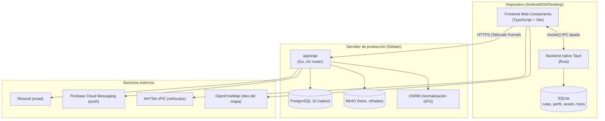

# 01 · Resumen ejecutivo

## Qué es Moto Routes

**Moto Routes (Ride Tracker)** es una aplicación móvil para motociclistas que combina **navegación
GPS, grabación de rutas y bitácora multimedia**. Se usa montada en el manillar de la moto, en
exterior y con guantes — de ahí el diseño "Asfalto Nocturno" (modo oscuro obligatorio) y hitboxes
mínimas de 56×56 px.

Target prioritario: **Android** (APK Tauri sobre dispositivo real), con soporte para iOS y Desktop
desde la misma base de código.

## Tipo de proyecto

**Monorepo** con dos aplicaciones más la infraestructura de desarrollo:

```
moto-routes/
├── apps/
│   ├── mobile/     # App móvil (TypeScript + Rust + Tauri 2 + Web Components)
│   └── api/        # API backend (Go)
├── infra/docker/   # Orquestación Docker Compose (desarrollo local + prod)
├── openspec/       # Source of truth del SDD (specs + cambios)
├── specs/          # Histórico congelado del SDD anterior
├── docs/           # Documentación de arquitectura (VitePress)
├── memory/         # Memoria persistente (context.md, decisions.md/ADRs, sessions/)
├── scripts/        # Scripts de despliegue y utilidades
└── documentacion/  # Este informe
```

## Arquitectura de alto nivel



## Componentes principales

1. **App móvil (`apps/mobile/`)**
   - Frontend: **Web Components nativos** (Custom Elements v1 + Shadow DOM), sin framework.
   - Backend nativo: **Rust + Tauri 2**, con comandos IPC tipados.
   - Persistencia local: **SQLite** vía `@tauri-apps/plugin-sql`.
   - Mapa: **MapLibre GL** con tiles de OpenFreeMap.
   - Graba rutas GPS en tiempo real, fotos, tipos de parada, perfil, logros y sincronización a la nube.

2. **API backend (`apps/api/`)**
   - **Go** con router `chi`, driver `pgx/v5` para PostgreSQL.
   - Autenticación JWT + bcrypt, verificación de email, reset de contraseña, rate limiting.
   - Rutas en la nube (sincronización, listado, detalle, exportación GPX, favoritos, compartir).
   - Fotos cifradas (AES-256) almacenadas en MinIO.
   - Notificaciones push vía FCM y envío de email vía Resend.

3. **Infraestructura (`infra/docker/`)**
   - Docker Compose para desarrollo local: `postgres`, `minio`, `osrm` y `api`.
   - Producción: servidor Debian con PostgreSQL y MinIO nativos y `apps/api` en contenedor
     (`network_mode: host`), expuesto por **Tailscale Funnel**.

## Metodología (resumen)

El proyecto sigue **Spec-Driven Development (SDD) sobre OpenSpec**: no se escribe código sin un cambio
abierto en `openspec/changes/` (ciclo propose → apply → archive), con **TDD estricto** (RED → GREEN →
REFACTOR), gate de revisión obligatorio y disciplina de rama (`feature/<nombre>` → PR a `master`).

El detalle completo está en [03-metodologia-y-calidad.md](03-metodologia-y-calidad.md).
