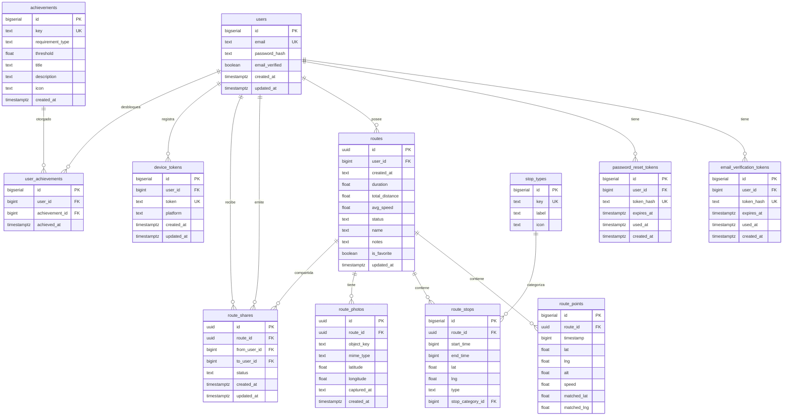
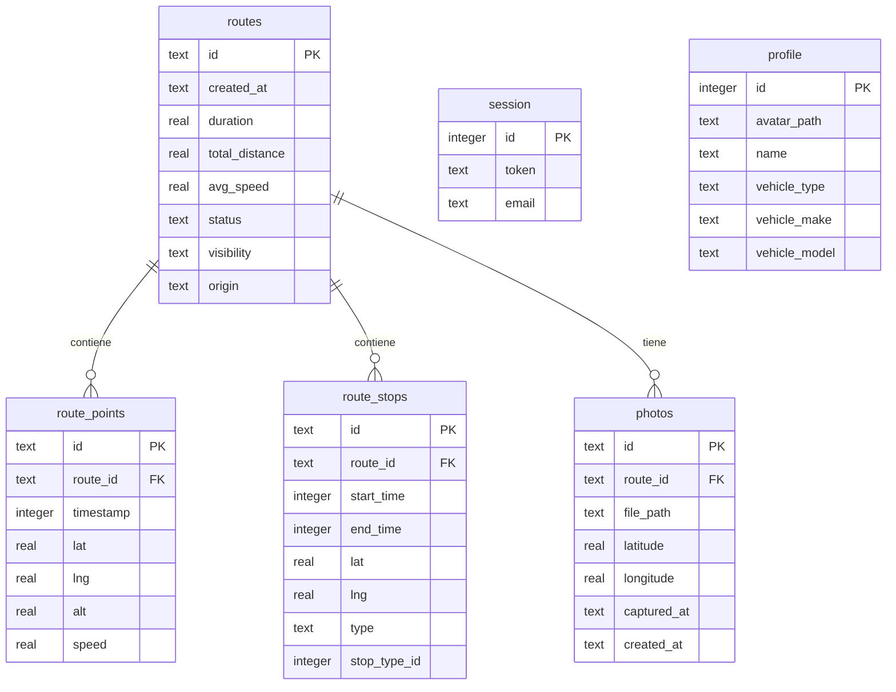

# 04 · Modelo de datos

Hay **dos bases de datos** con modelos distintos:

1. **PostgreSQL 16** (servidor) — modelo de la API backend, definido por migraciones versionadas en
   `apps/api/internal/migrate/migrations/`.
2. **SQLite** (dispositivo) — modelo local de la app, definido por los repositorios en
   `apps/mobile/src/shared/repositories/`.

## 1. PostgreSQL (backend)

### Diagrama entidad-relación

### Migraciones (orden de aplicación)

| Fichero | Contenido |
|---------|-----------|
| `0001_create_users.sql` | Tabla `users` |
| `0002_create_stop_types.sql` | Catálogo `stop_types` + seed (8 tipos) |
| `0003_add_email_verification.sql` | `email_verified` + `email_verification_tokens` |
| `0004_add_password_reset.sql` | `password_reset_tokens` |
| `0005_create_routes.sql` | `routes`, `route_points`, `route_stops` |
| `0006_create_route_photos.sql` | `route_photos` |
| `0007_add_route_favorite.sql` | `is_favorite` en `routes` |
| `0008_create_route_shares.sql` | `route_shares` |
| `0009_create_achievements.sql` | `achievements` + `user_achievements` + seed (10 logros) |
| `0010_create_device_tokens.sql` | `device_tokens` (FCM) |
| `0011_add_route_points_matched.sql` | `matched_lat`/`matched_lng` en `route_points` |

Las migraciones se aplican al arrancar la API (`migrate.Run`) y quedan registradas en la tabla
`schema_migrations` (version + applied_at). Son idempotentes.

### Notas del modelo

- `users.id` es `BIGSERIAL` (entero), mientras que `routes.id`, `route_photos.id` y `route_shares.id`
  son `UUID`.
- `routes.created_at` es `TEXT` libre (el cliente envía ISO 8601); hay una función
  `safe_parse_timestamptz()` para castear de forma tolerante en agregados de logros.
- Las relaciones usan `ON DELETE CASCADE` (borrar un usuario/ruta borra sus dependencias).
- `device_tokens.token` es único (un token FCM por fila).
## 2. SQLite (dispositivo / app móvil)

Persistencia local vía `@tauri-apps/plugin-sql`, gestionada por los repositorios en
`src/shared/repositories/`. No hay autenticación multi-usuario en el dispositivo: las tablas
`session` y `profile` son de **fila única** (`id = 1`).

### Diagrama entidad-relación

### Tablas y repositorios

| Tabla(s) | Repositorio | Propósito |
|----------|-------------|-----------|
| `routes`, `route_points`, `route_stops` | `sqlite-route.repository.ts` | Rutas grabadas y sus puntos/paradas |
| `photos` | `sqlite-photo.repository.ts` | Fotos locales (path en `$APPDATA/photos`) |
| `session` | `sqlite-session.repository.ts` | Sesión JWT del usuario (fila única) |
| `profile` | `sqlite-profile.repository.ts` | Perfil y vehículo del usuario (fila única) |

### Notas

- `routes.visibility` (`private`/`public`) y `routes.origin` (`local`/`cloud`) son campos propios de
  la copia local que no existen en el modelo del backend (allí el origen lo determina el usuario
  dueño de la fila y la visibilidad se gestiona en la lógica).
- Las claves foráneas usan `ON DELETE CASCADE`.
- La migración de esquema se hace con `CREATE TABLE IF NOT EXISTS` memoizado (`ensureSchema()`) y, en
  el caso de `photos`, un `PRAGMA table_info` para añadir columnas nuevas a tablas ya existentes.
- Los repositorios se instancian a través de **factories** (`sqlite-*.factory.ts`) que inyectan la
  conexión; hay variantes en memoria (`memory-*.repository.ts`) para tests.

