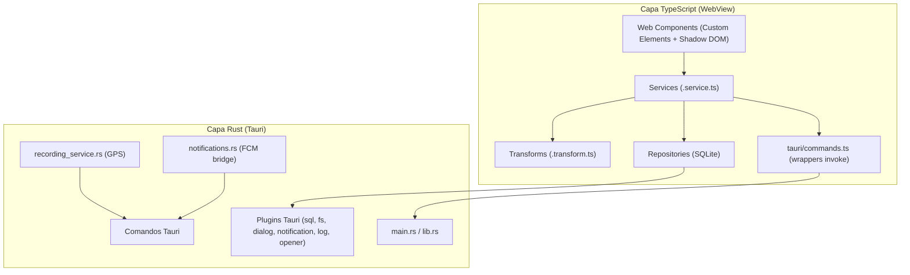

# 06 · Frontend — App móvil Tauri (`apps/mobile/`)

App multiplataforma (Android/iOS/Desktop) con **Web Components nativos** (sin framework de UI) sobre
**Tauri 2** (Rust), orientada a usarse montada en el manillar de una moto.

## Arquitectura de capas



## Organización por dominio

```
apps/mobile/src/
├── app/          # Componente raíz (app-root), seed inicial
├── auth/         # Login, registro, reset contraseña, verificación
├── cockpit/      # Grabación de ruta (GPS, paradas, fotos, persistencia)
├── routes/       # Listado + detalle + timeline + compartir
├── profile/      # Perfil y vehículo (vPIC)
├── achievements/ # Logros
└── shared/
    ├── styles/tokens.css      # Design tokens ("Asfalto Nocturno")
    ├── repositories/          # Repositorios SQLite + factories
    ├── models/                # Interfaces/tipos de dominio
    ├── services/              # Servicios transversales (device-token, notification-tap…)
    ├── tauri/commands.ts      # Wrappers tipados de invoke<T>()
    ├── tauri-plugins/         # plugin-camera propio + wrappers
    └── base-element.ts        # BaseElement (render Shadow DOM)
```

Cada fichero `.element.ts` va con su `.element.css` (que importa `tokens.css`, porque un Shadow DOM
no hereda `index.css`), `.service.ts`, `.transform.ts` y `.types.ts` según necesidad.

## Comunicación TS ↔ Rust

- **IPC tipado** con `invoke<T>()`, envuelto en `src/shared/tauri/commands.ts`. Nunca
  `window.__TAURI__` directo (`withGlobalTauri: false`).
- Ejemplos de comandos: obtención de token FCM (`get_notification_token`), pending token/tap,
  localización GPS nativa.

## Rust (backend móvil)

- `src/main.rs` y `src/lib.rs` — entry points de la app Tauri.
- `recording_service.rs` — plugin nativo de grabación GPS (solo Android; no-op en otras plataformas).
- `notifications.rs` — puente con el plugin Android de notificaciones push (FCM).

## Plugins y capacidades Tauri

### Plugins activos

`tauri-plugin-sql` (sqlite), `tauri-plugin-fs`, `tauri-plugin-dialog`, `tauri-plugin-notification`,
`tauri-plugin-log`, `tauri-plugin-opener`, más el **plugin de cámara propio**.

### Capacidades (`capabilities/default.json`) — permisos mínimos

- `core:default`, `core:window:*` (close/set-size/set-position), `opener:default`, `log:default`.
- `sql:default` + `sql:allow-load/execute/select`.
- `notification:default`, `dialog:allow-save`.
- `fs:allow-mkdir/exists/write-file/read-file/remove` **acotadas a `$APPDATA/photos`** (nada fuera).

Cada permiso nuevo debe añadirse explícitamente aquí (ADR-014).

## CSP (Content Security Policy)

Definida en `index.html` (y replicada en `tauri.conf.json`), sin `unsafe-eval` ni `unsafe-inline` de
script. `connect-src` incluye los hosts exactos: `self`, `ipc:`, `http://ipc.localhost`,
`https://tiles.openfreemap.org`, `https://vpic.nhtsa.dot.gov`, `http://localhost:8080`. En producción
el CI añade el host real de la API al `connect-src` y a `VITE_API_BASE_URL`.

## Mapa

- **MapLibre GL** 5.24.0 con tiles de OpenFreeMap (`https://tiles.openfreemap.org/styles/dark`),
  cargadas con `fetch()` nativo del WebView (sin plugin HTTP — ADR correspondiente).

## Diseño "Asfalto Nocturno"

- Modo oscuro **obligatorio** (sin variante clara), por seguridad vial.
- Tokens en `src/shared/styles/tokens.css` (`--bg-top`, `--panel`, `--amber`, `--ink`,
  `--font-display/ui/data`, `--hitbox-min`…).
- Tipografías: Roboto Slab (titulares) + Barlow (UI) + Barlow Semi Condensed tabular (cifras).
- Hitboxes ≥ 56×56 px, contraste WCAG AA, `prefers-reduced-motion`.
- Documento de referencia: `specs/ui/design-system.md`.

## Testing y calidad (frontend)

- Vitest 3 + jsdom, cobertura ≥ 80%.
- Cypress 15 E2E (contra backend Docker real).
- ESLint 9 (`strictTypeChecked` + `stylistic` + `eslint-plugin-jsdoc`), Prettier 3.
- Límites de tamaño por función/fichero (complejidad), con excepciones documentadas
  (`route-detail.element.ts`).

## Android nativo (generado)

- `gen/android/` contiene el proyecto Android generado por Tauri, con Kotlin propio:
  `MainActivity.kt`, `NotificationsPlugin.kt` y `FcmService.kt` (Firebase Cloud Messaging).
- `app/build.gradle.kts` es un fichero **trackeado y editable directamente** (no se regenera en cada
  build) — importante antes de modificarlo (ADR-047).
- `google-services.json` **no está versionado** (ver 07).
