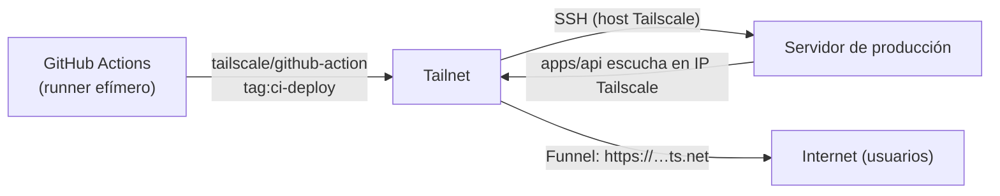

# 08 · Tailscale y red

Tailscale se usa para **conectar de forma segura** la máquina de desarrollo, el CI y el servidor de
producción, sin exponer la API a internet de forma convencional (sin IP pública propia ni apertura de
puertos en el router).

## Qué hace Tailscale aquí

1. **Acceso privado a la API**: `apps/api` en producción escucha **solo en la interfaz Tailscale** del
   servidor (no en loopback ni en 0.0.0.0). La app móvil en producción apunta a esa IP/host.
2. **Acceso público limitado vía Tailscale Funnel**: el servidor expone `apps/api` con una URL pública
   HTTPS gestionada por Tailscale, usada para los enlaces de verificación de email/reset que deben ser
   abribles por un usuario aunque no esté en el tailnet.
3. **Despliegue por SSH**: GitHub Actions se une a la tailnet de forma efímera y hace SSH al servidor
   por su nombre/host de Tailscale para desplegar.
4. **Diagnóstico**: la máquina de desarrollo tiene el cliente Tailscale instalado
   (`tailscale status`, `tailscale ip -4`, `tailscale ping`, etc.).

## Versiones y componentes

| Componente | Versión / dato |
|------------|----------------|
| GitHub Action | `tailscale/github-action` — **v4.1.3** (pinneada por SHA `780049a30b6ff5c378a9e7b389d15ece7a204888`) |
| Cliente local | `C:\Program Files\Tailscale\tailscale.exe` (Windows, máquina de desarrollo) |
| Comandos en servidor | `tailscale ip -4`, `tailscale funnel --bg` |
| Tailnet | la del usuario/proyecto (nombres `*.ts.net`) |

> No hay una versión del binario de Tailscale "pineada" dentro del repo: la versión concreta la fija
> cada máquina al instalar/actualizar el cliente. Lo único versionado y pinneado es la GitHub Action
> (v4.1.3).

## Tags y ACL

- El runner efímero de CI se une a la tailnet con el tag **`tag:ci-deploy`** (OAuth client/secret en
  GitHub Secrets `CLIENTID` / `CLIENTSECRET`).
- El servidor usa un tag propio (referido en las ADR como `tag:prod-server`), que debe estar incluido
  en la ACL de Funnel para que la URL pública funcione.

## Flujo de despliegue con Tailscale (resumen)

## URLs y direcciones

- La API en producción se alcanza por el **nombre Tailscale del servidor** (host público de Funnel,
  documentado en las ADR). La **IP interna de Tailscale del servidor está redactada** en los ficheros
  versionados (`.env.prod.example` usa `SERVER_ADDRESS=[tailscale-ip-redactada]`) por ser un repo
  público — nunca se hardcodea la IP en el código (se resuelve en runtime con `tailscale ip -4`).

## Decisiones asociadas (ADRs)

- ADR-033 / ADR-035 / ADR-036 — despliegue por SSH vía Tailscale y uso de Tailscale Funnel.
- ADR-041 — hardening del despliegue del servidor.
- ADR-044 — despliegue automático del backend desde GitHub Actions (revierte la "ceremonia manual").
- ADR-045 — incidente de Funnel que dejó de resolver públicamente (lección: verificar DNS desde
  **fuera** del tailnet, no desde la máquina del mismo tailnet).

## Consideraciones

- `network_mode: host` en el contenedor de `apps/api` en producción hace que el loopback del
  contenedor y el del host sean el mismo; la API se liga a la IP Tailscale para no escuchar en
  `localhost:8080` (por eso `deploy-local.sh` comprueba salud contra la IP Tailscale, no contra
  `localhost`).
- Cualquier release futura debe seguir apuntando a la URL de Funnel, no a la IP Tailscale directa.
